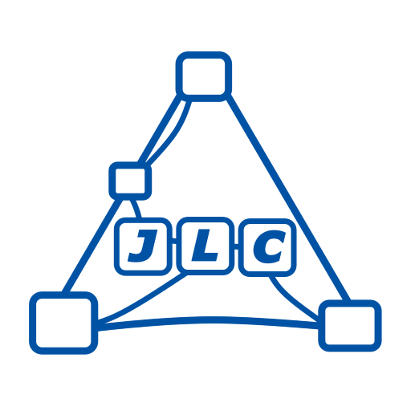

# JLC ComfyUI Nodes

<p align="center">
  
  &nbsp;&nbsp;&nbsp;
  
</p>

<p align="center">
  <a href="https://registry.comfy.org/packages/jlc-comfyui-nodes">
    
  </a>
  
  
  
</p>

JLC ComfyUI Nodes is a custom-node collection built around Non-Recursive ControlNet Composition, a method introduced by this project to replace recursively nested multi-ControlNet evaluation with a flattened composition path whose execution cost scales approximately linearly with the number of applied ControlNets, rather than accumulating the severe repeated work, runtime growth, and memory pressure of native recursive chains.

The collection also includes supporting tools for padded inpainting and outpainting, dynamic ControlNet auxiliary preprocessing, dynamic LoRA loading, stage-boundary VRAM cleanup, multi-image resizing, compact wireless connections, compact multi-lane rerouting, and frontend workflow control.

Release 2.1.0 expanded the utility family with JLC Resize Multiple Images, the production-ready JLC Multi Set/Get pair, and JLC Boolean Logic (Frontend), which replaced the earlier dedicated AND prototype. A subsequent minor update adds JLC Multi Reroute and hardens JLC Multi Set/Get virtual-link handling for ComfyUI subgraphs.

Developed by J. L. Córdova, the project is especially focused on Flux-oriented image-generation pipelines, ControlNet-heavy workflows, multi-stage inference, LoRA experimentation, and advanced inpainting and outpainting.

The current ControlNet Composition, Orchestrator, Orchestrator Advanced, Apply Advanced, shared composition core, and dynamic slot-visibility paths were audited and validated against ComfyUI commit 2a610155 from June 22, 2026, with frontend package 1.45.19. Validation included demanding Flux workflows with multiple LoRAs, Union ControlNet models, repeated ControlNet use, and as many as four ControlNet slots. See the detailed ControlNet guide for the full compatibility baseline, benchmark context, and runtime recommendations.

---

## Start Here: Release 2.0 Showcase Workflows

These showcase workflows demonstrate the breadth of the node pack and provide practical starting points for exploring Release 2.0.

The **JLC ControlNet Orchestrator (Advanced)** workflow serves both as an approachable starting point for new users and as a reference implementation of the package’s non-recursive ControlNet composition system.


[Download PNG workflow](assets/workflows/Release_2.0/jlc_Orchestrator_Advanced_workflow.png) ·
[Download JSON workflow](assets/workflows/Release_2.0/jlc_Orchestrator_Advanced_workflow.json)

The **JLC All-In-One Workflow** presents the collection as a complete working toolchain rather than a set of isolated nodes. It combines ControlNet with representative nodes from the ControlNet Aux, Dynamic LoRA Loader, padded-image and padded-latent, and utility families.


[Download PNG workflow](assets/workflows/Release_2.0/jlc_All_In_One_workflow.png) ·
[Download JSON workflow](assets/workflows/Release_2.0/jlc_All_In_One_workflow.json)

As with the other workflows included in this documentation, each example is provided both as a PNG with an embedded workflow for direct drag-and-drop into ComfyUI and as a JSON file for standard workflow loading.

---

## Documentation

This README is the front page for the repository. Detailed documentation is
organized by node family:

1. [ControlNet Composition and Orchestration](docs/controlnet-composition.md)
2. [Padded Image / Padded Latent](docs/padded-image-latent.md)
3. [ControlNet Aux Preprocessor Wrappers](docs/controlnet-aux.md)
4. [Dynamic LoRA Loaders](docs/lora-loaders.md)
5. [Utility Nodes](docs/utility-nodes.md)

---

## Node Families

### 1. ControlNet Composition and Orchestration

A family of nodes for native ControlNet application, modular chain construction, and explicit linearized non-recursive weighted fusion.

This family includes:

- **JLC ControlNet Composition**
- **JLC ControlNet Orchestrator**
- **JLC ControlNet Orchestrator (Advanced)**
- **JLC ControlNet Apply**
- **JLC ControlNet Apply (Advanced)**

The central design treats prepared ControlNets as independent operators evaluated against the same sampler state and combines their outputs through explicit weighted addition. The modular **Apply Advanced → Composition** workflow and the integrated **Orchestrator Advanced** workflow use the same validated fusion core.

- **Orchestrator Advanced** is the recommended integrated interface for most new multi-ControlNet workflows.
- **Apply Advanced → Composition** is a first-class modular interface when explicit chaining, pass-through wiring, or separate model sourcing is useful.
- **Orchestrator** remains the specialized external-input interface for ControlNet objects supplied by standard, third-party, custom, or nonstandard-location loaders.

[Read the ControlNet guide](docs/controlnet-composition.md)

---

### 2. Padded Image / Padded Latent

Nodes for padded-canvas workflows, especially inpainting and outpainting.

This family includes:

- **JLC Padded Image**
- **JLC Inpaint-Conditioned Padded Latent**

Use **Padded Image** when you want image, mask, and canvas preparation while keeping VAE encoding and inpaint conditioning separate. Use **Padded Latent** when you want a more integrated node that prepares the padded canvas and also injects inpaint-conditioning metadata.

[Read the Padded Image / Padded Latent guide](docs/padded-image-latent.md)

---

### 3. ControlNet Aux Preprocessor Wrappers

A dynamic convenience wrapper for simple image-in/image-out preprocessors provided by **Fannovel16's `comfyui_controlnet_aux`** package.

This family currently includes:

- **JLC Dynamic Aux Preprocessor Wrapper**

The wrapper does not replace Fannovel16's nodes and does not claim ownership of the underlying preprocessors. It provides a compact multi-slot interface for JLC workflows that need several simple ControlNet hint images from the same source image. Parameter-heavy preprocessors should still be used through their native ControlNet Aux nodes.

`comfyui_controlnet_aux` must be installed for non-disabled preprocessor slots to run.

[Read the ControlNet Aux guide](docs/controlnet-aux.md)

---

### 4. Dynamic LoRA Loaders

Dynamic LoRA loader nodes for MODEL-only and MODEL+CLIP workflows, including shared and per-slot block-weight variants.

This family includes:

- **JLC LoRA Loader - Multi Model**
- **JLC LoRA Loader - Multi-Model / CLIP**
- **JLC LoRA Loader - Multi-Model / Shared Block Weight**
- **JLC LoRA Loader - Multi Model / Shared Block Weight + CLIP**
- **JLC LoRA Loader - Multi-Model / Block Weight**
- **JLC LoRA Loader - Multi-Model / CLIP + Block Weight**

These nodes predeclare up to ten LoRA slots and use frontend visibility controls to expose only the active rows. Hidden slot values remain serialized in workflow JSON, while the backend treats `slot_count` as authoritative. MODEL-only variants intentionally avoid CLIP/text-encoder patching; MODEL+CLIP variants expose independent MODEL and CLIP strengths.

[Read the LoRA Loader guide](docs/lora-loaders.md)

---

### 5. Utility Nodes

Workflow-support nodes for seed discipline, stage-boundary memory hygiene, image resizing, compact wireless connections, compact visible rerouting, and frontend Switchboard control.

This family includes:

- **JLC Seed Generator** — shared seed source that keeps the visible base seed stable while a frontend display reports the last seed actually used.
- **JLC Stage Boundary VRAM Cleanup** — experimental latent-passthrough cleanup helper for advanced multi-stage workflows where selected heavy model objects should be unloaded before the next stage.
- **JLC Resize Multiple Images** — applies one shared aspect-ratio-preserving resize policy to one through five images, with separate outputs and a convenience normalized batch output.
- **JLC Multi Set** and **JLC Multi Get** — production-ready virtual nodes that replace groups of individual wireless Set/Get nodes with up to twenty-four independently named, dynamically typed channels. Rows grow and compact automatically while preserving stable channel identities and physical links.
- **JLC Multi Reroute** — frontend virtual node providing one through twenty-four independent visible reroute lanes in a single compact node. Lanes grow automatically, compact when fully disconnected, preserve normal fan-out, and use ComfyUI's standard socket/link colors for their resolved data types.
- **JLC Boolean Logic (Frontend)** — pure client-side two-input logic for ComfyUI-Switchboard controllers, supporting AND, OR, XOR, NAND, NOR, XNOR, and the two directional AND-NOT operations. It is a Switchboard companion, not a standalone backend Boolean node.

[Read the Utility Nodes guide](docs/utility-nodes.md)


---

## Installation

Install through the **ComfyUI Registry**:

[https://registry.comfy.org/packages/jlc-comfyui-nodes](https://registry.comfy.org/packages/jlc-comfyui-nodes)

Manual install:

```bash
cd ComfyUI/custom_nodes
git clone https://github.com/Damkohler/jlc-comfyui-nodes.git
```

Restart ComfyUI after installation or update.

To update manually:

```bash
cd ComfyUI/custom_nodes/jlc-comfyui-nodes
git pull
```

### Optional dependency: ControlNet Aux preprocessors

The **JLC Dynamic Aux Preprocessor Wrapper** requires Fannovel16's `comfyui_controlnet_aux` package when any non-disabled preprocessor slot is used.

Install it through ComfyUI Manager, or follow the upstream installation instructions:

[https://github.com/Fannovel16/comfyui_controlnet_aux](https://github.com/Fannovel16/comfyui_controlnet_aux)

Some upstream preprocessors may download or load large auxiliary models the first time they are used.

---

## Compatibility Notes

The nodes are designed for ComfyUI custom-node workflows and have been developed primarily around:

- Flux-based image generation
- ControlNet-heavy pipelines
- LoRA experimentation
- inpainting and outpainting
- multi-stage inference graphs

The current ControlNet family is aligned with the ComfyUI sampler, ControlNet, model-management, hook, and lifecycle interfaces present at the tested baseline documented in the ControlNet guide. Later ComfyUI revisions may require renewed testing if those interfaces change.

For the validated 16 GB RTX 4090 Laptop workflow, use normal ComfyUI VRAM behavior with DynamicVRAM where desired. Forced `--lowvram` is not recommended for the benchmarked Flux and multi-ControlNet configurations because it caused destructive partial unload/reload cycles and severe execution-time regression.

Real MultiGPU ControlNet cloning is not implemented by the JLC composed wrapper. The compatibility attributes present in the wrapper are single-device shunts, not a claim of MultiGPU support.

---

## Repository Structure

The current repository includes these main areas:

```text
nodes/
  controlnet_aux_nodes/
  engines/
  lora_loader_nodes/
  util_nodes/
web/
assets/
  icons/
  workflows/
docs/
```

A generated repository map is also included:

```text
jlc-comfyui-nodes-structure.txt
```

---

## License

MIT License.

---

## Author

**J. L. Córdova**  
GitHub: [Damkohler](https://github.com/Damkohler)

---

## Contributions

Suggestions, bug reports, and improvements are welcome through GitHub issues or pull requests.
